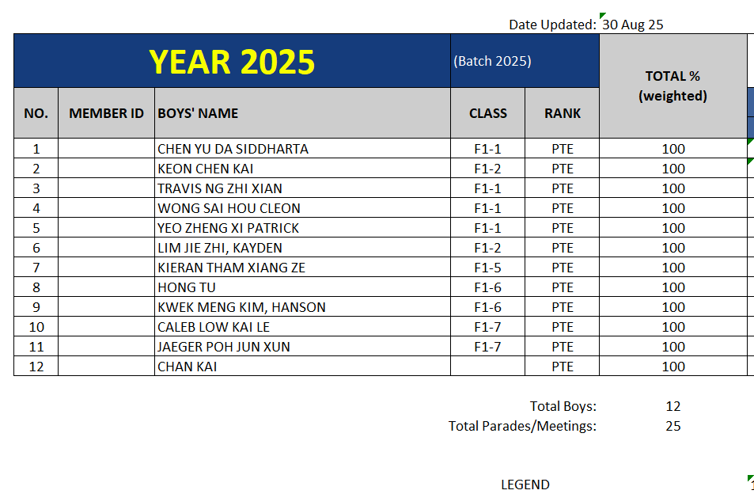
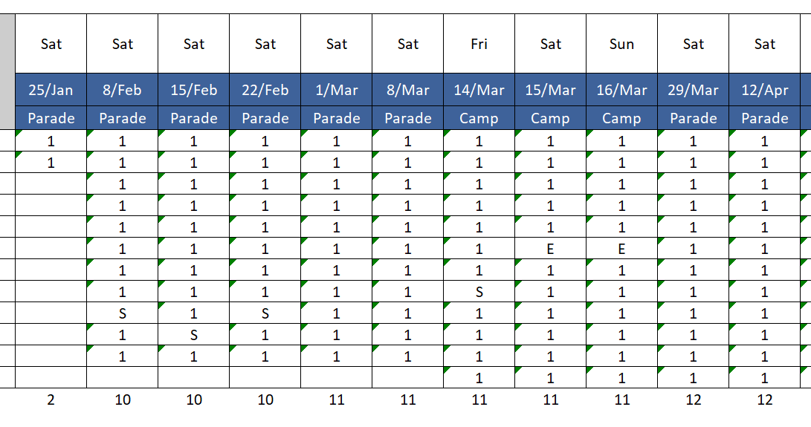
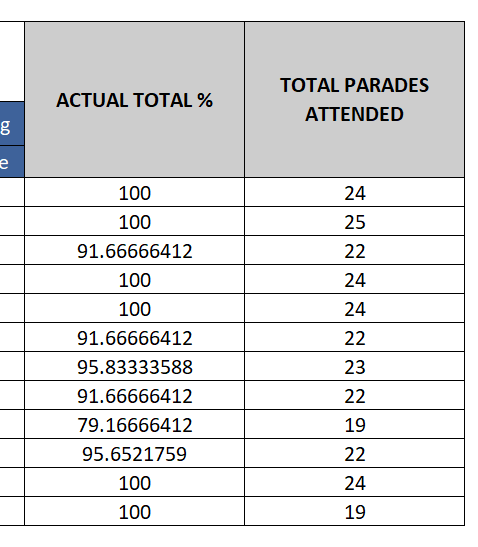

# For Me to understand the attendance file

| Item | Explanation |
|------|-------------|
| Year XXXX | The year of which this excel file is generated. (For eg: YEAR 2025) |
| Batch XXXX | The year at which these Boys entered GMSS. This is irregardless of when the Boy(s) entered BB (due to change of CCA). The batch year is calculated as $\text{Current Year} - \text{Secondary Level}$. Note that for Primers and Officers, this column is ommitted |
| No | Just a incremental number |	
| Member ID | Members portal ID. Only applicable for boys. Primers, Officers and Volunteers to skip this row |
| Boys' Name | Name of user categories. Header Boys to be named "Boys". Primers to be named "Primers". Officers to be named "Volunteers". |
| Class | For boys, class is the GMSS secondary level class name (for eg: F1-1, P4-2). For Primers, its hardcoded as "POLY" regardless of the "class1" attribute of the user management page. For Officers, its the "class1" attribute of the user management page (for eg: VAL, STAFF). Leave blank if class not found or not applicable. |
| Rank | Rank is the respective HQ given rank of the user. Eg: SGT, LCP, PTE for Boys. CLT, SCL for Primers. 2LT, LTA for Officers. Leave blank if rank not found or not applicable. |
| Total % (Weighted) | Calculated as $\frac{\text{Number of "1"}}{\text{(Number of "1")} + \text{(Number of "0")}}$.  NOTE: Need to <code>Math.fround()</code> |
| Date Updated | The last recorded attendance date. Format is <code>{ day: "2-digit", month: "short", year: "2-digit" }</code>  This is also the same date for the excel workbook title.  |
| Total Boys | Number of a specific account type. Boys named as "Total Boys". Primers named as "Total Primers". Officers named as "Total Officers". |
| Total Parades/Meetings | This is the total number of unique dates of attendance. This numbers differ for different account types. |

| Item | Explanation |
|------|-------------|
| Day | The day at which this attendance is taken. Note that it may not always be on saturday |
| Date | The date at which this attendance is taken. Format is <code>{ day: "2-digit", month: "short"}</code> |
| Parade Type | The parade type is derived from the parade notice creation form, field "Parade Type" |
| Attendance | This is the attendance status. Theres 1 record per user per date.  Values for this must only be:  <pre>Value: 1 Type: Number</pre><pre>Value: 0 Type: Number</pre><pre>Value: S Type: String</pre><pre>Value: E Type: String</pre> |
| Total Present | This calcuates the total number of people by account type/platoon that are present. This number is displayed at the bottom of each attendance status column. Calculated as: $\text{Sum of "1"}$ |

| Item | Explanation |
|------|-------------|
| Actual Total % | Calculated as: $\frac{\text{Number of "1"}}{\text{(Number of "1")} + \text{(Number of "0")} + \text{(Number of "S")} + \text{(Number of "E")}}$  NOTE: Need to <code>Math.fround()</code> |
| Total Parades attended | Calculated as: $\text{Sum of "1"}$ |